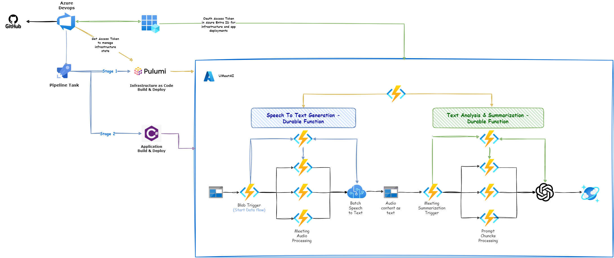
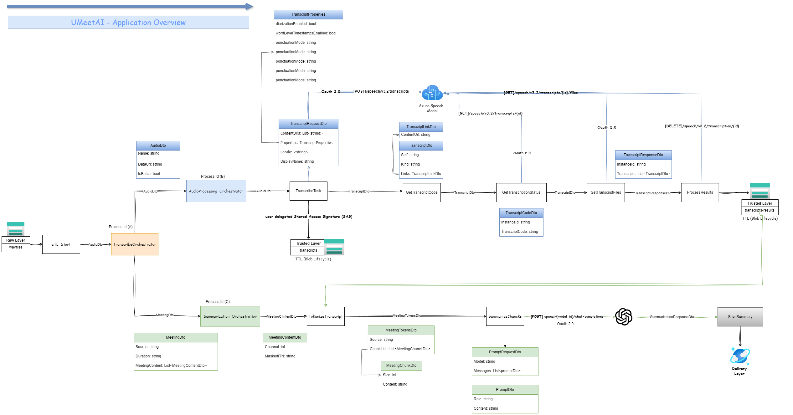

# Meeting Summarization App

## Overview

The Meeting Summarization App is designed to transcribe and summarize meeting recordings using Azure Durable Functions and AI services. This application automates the process of converting audio files into text, identifying key points, and generating a concise summary of the meeting content.

## Architecture

## Features

- **Audio Transcription**: Converts audio recordings into text using Azure Cognitive Services.
- **Summarization**: Uses AI models to summarize transcribed text, highlighting key points and action items.
- **Scalability**: Leverages Azure Durable Functions to handle large volumes of data and complex workflows efficiently.
- **Storage**: Stores transcriptions and summaries in Azure Blob Storage for easy access and retrieval.

## Application Overview
Most integrations between Azure Durable Functions and Azure AI services, including AI Speech and Azure OpenAI, were implemented using the standard .NET HTTP library. The design leverages Data Transfer Objects (DTOs), a widely adopted software engineering pattern, to facilitate structured data communication between services. The flowchart below illustrates the calling sequence of functions within the orchestration and highlights the data shared between them throughout the process.

## Prerequisites

- Azure Subscription
- Azure Functions Core Tools
- .NET SDK
- Azure Storage Account
- Pulumi
